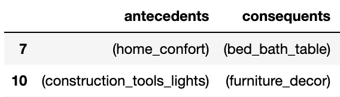

# Brazilian_EComm_Predictions

## Problem Statement
Identify, Predict and Prevent Churn

## Team Members
* Shilpa Gollamudi ***(Team Leader)***
* Mandy Fu
* Shrouq Alelaumi
* Armine Khananyan
* Steven Salazar

## Overview

To review and provide an analysis breakdown of a dataset from an SMB (small and midsized buisness) known as Olist; by doing so, we will predict churn. 
In this review and analysis you'll see the tools that will be and were used to accomplish this.

This project reviews and analysis churn on a set of relational orders & products database from Olist. Olist is an SMB commerce enabler ecosystem, it connects merchants to marketplaces, that specilizes in the fileds of logistics and capital. Our data is sourced from Kaggle. It contains 9 datasets: 
1. Customers
2. Sellers
3. Orders
4. Order Items
5. Order Payments
6. Order Reviews
7. Products
8. Product Category Name
9. Geolocation

The data for churn prediction is labeled based on the outcome of recency frequncy monetary (RFM) customer segmentation technique. Differnt machine learning models were tested and evaulated using on 5-fold cross validation. Several evaluation metrics are collected and compared to identify the best model in terms of execution time and models' prediction perfromnce, such as: accuarcy, precision, recall, and AUC. The results showed that ensemble learning models (random forest and gradient boosting) are the best with AUC of 88%. 

## Dataset Summary and Challenges

The overall dataset was in good shape with the exception of the geolocation table. The table contained over 1M records with dups and unstandardized spelling of geo cities. However, the geo state values were in ISO 2 digit format like the customers and sellers table. We sanitized the geo city column by using python unicodedata library to remove unicode characters, normalize the spelling by converting it to lower case to match the format in the customers and sellers table, lastly we dedup. Since there are multiple geo coords for a group of zip, city, and state vlues, we took the average of latitudes and longitudes in that grouping and generate a geo ID. Lastly we map the geoID to the customers and sellers table. The final clean output was 19.6K from over 1M records in the geolocation table. However we were unable to map 136 seller accounts out of 3095 and 302 records out of 99K on the customers table.  

The ERDs below shows the relationship before and after the normalization of the geolocation table.

The Results from predicting churn = ***customer retention, satisfaction, and a great revenue source.***

## Tools and Libraries

- Python(Pandas, Numpy)
- Tableau, Matplotlib
- Sklearn
- SQL, PostGres

## Analysis

### Phase One - Exploring the Data

  

Data captured over the past 2 years

Before we can move further, we have to ensure that we have sufficent data to work with. When you're trying to predict churn, you will need, both qualitative and quantitative customer data. Within those two data types you will find the features that you will need for your machine learning models. Looking through the data, we made a consensus that we had sufficent data to progress further. It's important to note that with insufficent data, you will encounter inaccurate predictions when running your model. Do make sure you avoid making this mistake early on!

### Phase Three - Construction

To get labeled data for customer churn, RFM customer segmention is used. RFM segment customers based on when their last purchase was, how often they've purchased in the past, and how much they've spent overall. Based on those features, the customers can be divided into 11 main segemnts as below. 

Customers with category of "At Risk", "Hibernating customers", and "Lost" are labeled as chrun customers, while the remaining are labeled as no churn.

**Recency, Frequency, Monetary**

*What is RFM?*
1. Recency - How recently did the customer make the last purchase?
2. Frequency - How many purchases did the customer make?
3. Monetary Value - How much did the customer spend total?

*Why RFM?*
1. The first problem we ran into was not having the data labeled for prediction. RFM was the fix.

- The first step to constructing the RFM model was to define each category with specific features. To get our recency, we needed to use the customer unique ID and the order purchase timestamps. With those in our formula we were able to get the days in-between present day and last purchase.
- Next, we need frequency. The features used to get frequency were the customer unique ID and order ID: this told how frequent our customers made purchases.
- Lastly, the monetary value. Features selected for this portion were, again, the customer unique ID and then the payment value. This gives us how much the customers spent on purchases.
- Now that our RFM is defined, we merge the data together to create a new table so we can see our new data. 
- Next, we check for outliers by using a box plot. ***See below***

          

**The Outliers**

- From a glance we can see that we have some outliers. With that being said, we want to make sure we reliably remove the outliers that we don't need, so we use the 1.5 IQR rule.

**Creating the Segments and Linking the Scores**

We take our new data, create the labels, assign them, and then we add the segments. The segments will be matched up with the appropriate scores, letting us know where our customers stand. Here is the source we referred to: https://documentation.bloomreach.com/engagement/docs/rfm-segmentation 

From here we transform the data into what will show us the answers we've been working towards.

**Feature Engineering for Churn Prediction**

To improve the churn prediction performnce, appropriate features are constructed to use as an input for churn prediction model, as follows:

- Customer state
- Seller state
- Review upload time
- Debt customer
- Cash customer
- Working days estimated delivery time: Gets the days between order approval and estimated delivery date. A customer might be unsatisfied if he is told that the estimated time is big.
- Working days actual delivery time: Gets the days between order approval and delivered customer date. A customer might be more satisfied if he gets the product faster.
- Working days delivery time delta: The difference between the actual and estimated date. If negative was delivered early, if positive was delivered late. A customer might be more satisfied if the order arrives sooner than expected, or unhappy if he receives after the deadline
- Is late: Binary variable indicating if the order was delivered after the estimated date.
- Product category
- Review score
- Freight value
- Payment value
- Payment installments

The target variable is "Is churn", a binary variable indicating if the customer has churned or not. 

**Handling Imbalanced Dataset for Churn Prediction**

The churn problem is highly imbalnced dataset, where majorty of data is labled as no churn and limited sample size has churn label. Therefore, differnt class distribution balancing techniques was used to remove bais, such as: randomundersampling (RUS), Synthetic Minority Oversampling Technique (SMOTE), and SMOTE and Edited Nearest Neighbor (ENN) method (SMOTEENN). AUC evaluation metric is used to evaluate those techniques perfromnce in handling imbalnced dataset. The results indicates that RUS is the best in terms of AUC (87%) compared to 80% for SOMTE and 85% for SOMTEENN. In addition, RUS technique is more efficient as the training size is smaller.

**Feature Selection for Churn Prediction**

To improve churn prediction performnce, imrpove model's effeicincy, and avoid over-fiiting, permuation feature selection technique is used to eliminte irrelevant features. In this method, each feature is corputed and then model perfromnce is measured. if model perfromnce drops, this indicate that feature is important for prediction. 

The results of feature permuation indicates that some features are not helpful for churn prediction, and those got eliminated in next model evalution step.

**Model Evaluation for Churn Prediction**
Different ML models are tested for churn prediction, such as: ensemble models (random forest, gradient boosting, adaptive boosting), multi-layer perceptron (MLP), support vector machine (SVM), logistic regression, k-nearest neighbors (KNN), decision tree, and naive bayes classifer. 5-fold cross-valiadtion is used to evaluate the model perfromnce. 

Several evaluation metrics are collected through the k-fold cross-validation to better refelct the perfromnce under highly imbalanced dataset, such as: accurcay, recall, precision, AUC. The model excution time is comapred as well. The results indicated that Random forest & gradient boosting are the best with AUC of 88%.

## Product Recommendations and Market Basket Analysis
Given that we have done customer segmentation and have identified the churn, we are now targetting the other segments to retain customers and provide a better experience through our product recommendation system.

For product recommendations, one of the challenges we faced is that maximum number of transactions are single product purchases. But given this, we still need to figure out the market basket analysis.
Also, <i>explicit</i> vs <i>implicit</i> data.

Having access to explicit data that users have provided is not possible in this case, so we relied entirely on data generated from user activities on site.

### Initial Data Exploration ###  

  

#### Top popular products ####  

  

#### High Revenue Products ####  

 

### Selecting the Algorithm ###
Association Rule Mining(ARM) can be used to provide session-based recommendations and Apriori is one such widely accepted ARM algorithm. We wanted to establish rules to see if there were products pairs being purchased together, or what is the association of one product with the others.

General idea behind the Apriori algorithm:
We want to establish the the value of the below variables:
#### Support ####
Support refers to the popularity of item and can be calculated by finding the number of transactions containing a particular item divided by the total number of transactions.

$Support(diaper) = (Transactions containing (diaper))/(Total Transactions)$

#### Confidence ####
Confidence refers to the likelihood that an item B is also bought if item A is bought. It can be calculated by finding the number of transactions where A and B are bought together, divided by the total number of transactions where A is bought. Mathematically, it can be represented as:

$Confidence(A → B) = (Transactions containing both (A and B))/(Transactions containing A)$

#### Lift ####
Lift refers to the increase in the ratio of the sale of B when A is sold.
Lift(A –> B) can be calculated by dividing Confidence(A -> B) divided by Support(B).  

Mathematically it can be represented as:  

$Lift(A→B) = (Confidence (A→B))/(Support (B))$

$Lift(milk → diaper) = (Confidence (milk → diaper))/(Support (diaper))$

#### Steps involved in Apriori Algorithm ####

For larger dataset, this computation can make the process extremely slow.
To speed up the process, we need to perform the following steps:

1. Set a minimum value for support and confidence. This means that we are only interested in finding rules for the items that have certain default existence (e.g. support) and have a minimum value for co-occurrence with other items (e.g. confidence).
2. Extract all the subsets having a higher value of support than a minimum threshold.
3. Select all the rules from the subsets with confidence value higher than the minimum threshold.
4. Order the rules by descending order of Lift.

   

### Working on our dataset ###

**Importing and preparing our dataset**  

For this we first identified tables that are required and merged them. These are the tables that were merged:
1. olist_products_dataset.csv
2. product_category_name_translation.csv
3. olist_order_items_dataset.csv
4. olist_orders_dataset.csv
5. olist_customers_dataset.csv

After merging these tables, we get a dataframe like this:

    

**Data Preprocessing**  

The Apriori library requires the dataset to be in the form of list of lists of transactions. We then prepare this.
Next step, we identify the columns that we need to get the list of transactions made by customers.  

   

**Using Apriori**  

We now identify the frequent item sets by implementing apriori on our encoded list of lists, with a minimum of support of 0.001  

  

We now create association rules with frequent itemsets and we get 26 rules in all.  

  

With this we now sort the rules to get rules with highest lift.  

 

From the lookup table we can see that the rule that works best is:  

 

## Summary and Recommendations
- Recommendations from our findings

